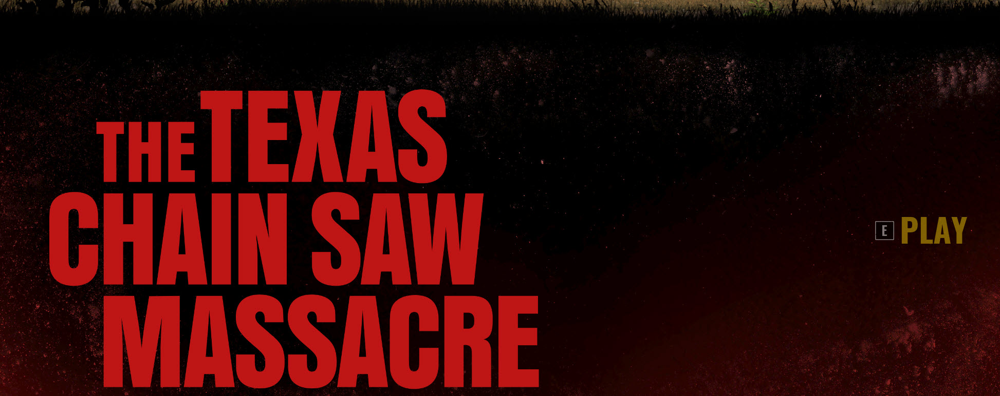
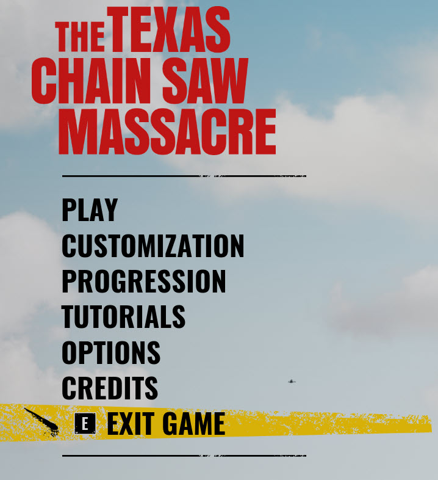
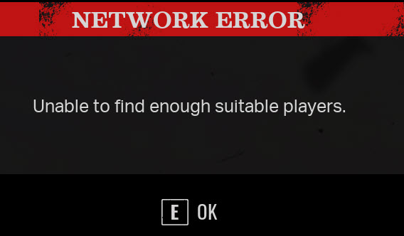
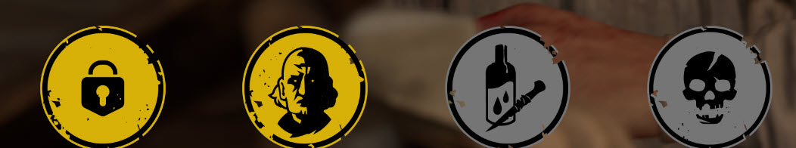

# TCMLobbyBBQ - v1.0

## What is this?
It is a Python script (`tcm.py`) for PC players of [The Texas Chain Saw Massacre](https://www.txchainsawgame.com/) to get into lobby queues more eficiently.

## Whoa, stop right there pal! Is this a cheat?
No!  It's not a cheat!  If you're a fan of the game, you know one or more of the following can happen to you:

* You wait for several minutes to get placed into a match, but never do.
* You're waiting for players in a lobby for waaaaaaay too many minutes, only to have the match fail to start.
* You're having a blast playing the game when suddenly you're kicked out due to ping time problems, "idle" false positives, etc.

## OK, so if it's not a cheat, WHAT DOES THIS SCRIPT DO?
This Python script (`tcm.py`) regularly monitors what's on your TCM game screen *before* a match, automatically selects the appropriate menus whether you want to play as victim or family, and then sends you notification(s) of your choice once the match actually begins!

## How does it work?
The script is powered by [PyAutoGUI](https://pyautogui.readthedocs.io/en/latest/) which, according to its documentation:

*PyAutoGUI lets your Python scripts control the mouse and keyboard to automate interactions with other applications. The API is designed to be simple. PyAutoGUI works on Windows, macOS, and Linux, and runs on Python 2 and 3.*

Once you launch the script, you will be prompted to choose to play as victim or family.  Then, you'll want to fire up TCM (and click into it if you have multiple monitors - so that the game is "active").  At that point, the script will take regular screenshots of your TCM game, compare it to various files in the `pics` subfolder, and take appropriate actions.

## I don't get it.  Be more specific.
Sure, once you run `tcm.py` and choose whether you want to play as victim or family, here is the continous loop of things the script will check/do:

1. **"Are you at the 'Auto Save' screen (`/pics/autosave.jpg`)?"**  If so, the script will press `E` to move you on to the next screen.  Then it will pause 5 seconds and press `E` again to move past the voiceover stuff.  


2. **"Are you at the main TCM splash screen (`pics/thetexastcm.jpg`)?"**  If so, the script will press `E` to continue.  


3. **"Are you at the main menu (`pics/mainmenu.jpg`)?"** If so, the script will hit `Up` a bunch of times and then `E` to continue.  


4. **"Are you at the "windmill" screen ready to pick family or victims(`pics/windmill.jpg`)?**  If so, the script will press `Up` a bunch of times to get to the top of the menu, and then `Down` the appropriate amount of times for either family or victim.


5. **"Are you in an active lobby (`pics/lobby.jpg`)?**  If so, that's awesome!  The script will just sleep for a bit.  


6. **"Were you in an active lobby and then the time ran out (`pics/unabletofindsuitableplayers.jpg`)?"** The script will press `E` to get you back in action.  


7. **"What character are you?"** The script will look in the `/pics` folder and try to match the character you've been matched with - then alert you about who that character is via Webhook (be sure to set the Webhook in the `.env` file!)  


8. **"OMg did you actually wait in a lobby and then the match ACTUALLY started (`pics/matchstart.jpg`)?** Congrats!  You should get a Webhook alert saying your match will begin shortly (again, be sure to set the Webhook in the `.env` file!)  


## This Python code looks like a baby wrote it
Be gentle.  We don't code *at all* and gave it our best shot, mom.

## This script blew up my computer, deleted all my files and made me miss a mortgage payment!
We're not reponsible at all for anything that happens - be it good, bad or indifferent - to your computer as a result of running this code.  Correction: if you win the lottery because of this script, we get half.

## OK I like to live dangerously like Austin Powers.  What do I do next?
This should get you started:

### Install the pre-reqs:
* Install [Python](https://www.python.org/downloads/windows/).  This script was tested on 3.10.11.  No idea if it will work on other versions!
* Install Python pre-reqs by running these commands at a command prompt:

```
pip install opencv-python
pip install pillow
pip install pyautogui
pip install python-dotenv
pip install requests 
```

### (Optional) Create an .env file
Personally, we like to use Discord Webhooks to alert us when certain actions in TCM happen. Not sure how to configure those?  [Read this](https://support.discord.com/hc/en-us/articles/228383668-Intro-to-Webhooks).
If you want to do this, create a file called `.env` in the same directory as `tcm.py` with a line like this:

```
WEBHOOK_URL="https://discord.com/api/webhooks/xxx"
```

Hint: look at the included `.env.example` file in this repo.

### (Optional) Edit tcm.py for max fun!
Take a look through the script and tweak the timeouts and alerts to your liking!

### Run tcm.py!
From a command prompt, run:

```
python tcm.py
```

You will be prompted to choose either `Family` or `Victim`.  Depending on which one you choose, `tcm.py` will automatically watch the screens of your TCM game and navigate the menus automatically to queue you in the appropriate lobby.

---

# Something's broken and/or I can make tcm.py better!
Great!  Raise an [issue](https://github.com/7MinSec/TCMLobbyBBQ/issues) and let's talk about it!
